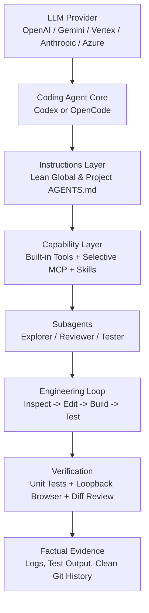

# Tune Your Code Agent

> Practical setup patterns for Codex and OpenCode.

Codex and OpenCode are useful out of the box, but the quality of the experience depends heavily on how the model, tools, instructions, and validation loop are configured.

This repository provides a practical way to build that setup progressively: start with model connectivity, keep instructions small, add tools only when they solve a real problem, and validate the whole environment before relying on it.

---

## What this repository covers

- **LLM providers:** Direct API, cloud-hosted enterprise endpoints (Vertex AI, Azure OpenAI), and local/OpenAI-compatible gateways.
- **Codex configuration:** Hierarchical config (`config.toml`), profiles, sandboxing modes, and execution approval policies.
- **OpenCode configuration:** Core architecture, `opencode.json`, custom model adapters, and permission boundaries.
- **Model Context Protocol (MCP):** Adding external tool servers deliberately without context bloat or schema collisions.
- **Tools & tool profiles:** Selecting the right tools for the job (Minimal, Engineering, Browser) instead of enabling everything.
- **Skills vs permanent instructions:** Using lightweight prompt discovery and progressive disclosure instead of monster system prompts.
- **Subagents:** Configuring focused child agents (`explorer`, `reviewer`, `tester`, `security`) for independent verification.
- **Git & GitHub integration:** Repository-scoped changes, commit hygiene, and automated code review workflows.
- **Browser automation:** Deterministic DOM and visual UI verification using Playwright loopback sessions.
- **Workspace isolation & guardrails:** Keeping agent actions scoped to the repository and avoiding global machine contamination.
- **Temporary artifact hygiene:** Keeping scratch files confined to `.agent-tmp/` and cleaning them after task completion.
- **Layered validation:** Verifying every layer from raw API ping to browser test before trusting an agent with production code.

---

## The setup in one picture



---

## A simple rule

> **Start small. Add capabilities when they solve a real problem. Validate each layer before adding the next one.**

More tools, giant prompt files, and unbounded subagent graphs do not make an agent smarter. They increase context consumption, cause tool selection ambiguity, and create brittle execution loops. Keep the base configuration lean and load specialized capabilities on demand.

---

## Quick start

### 1. Check your environment
Run the doctor script to verify local runtimes, CLI binaries, and environment variables:
```bash
python scripts/doctor/doctor.py
```

### 2. Verify model connectivity
Test your provider connection before configuring agent workflows. Smoke tests verify API reachability without sending sensitive information:
```bash
# Example: test OpenAI connectivity
python scripts/providers/test_openai.py

# Example: test Anthropic connectivity
python scripts/providers/test_anthropic.py

# Example: test Google Gemini API
python scripts/providers/test_gemini.py
```
See [`docs/providers.md`](docs/providers.md) for full provider setup details.

### 3. Choose your agent runtime
- For **Codex**, copy and adapt [`templates/codex/config.toml`](templates/codex/config.toml) and [`templates/codex/AGENTS.md`](templates/codex/AGENTS.md). Read [`docs/codex.md`](docs/codex.md).
- For **OpenCode**, copy and adapt [`templates/opencode/opencode.json`](templates/opencode/opencode.json) and [`templates/opencode/AGENTS.md`](templates/opencode/AGENTS.md). Read [`docs/opencode.md`](docs/opencode.md).

### 4. Select a tool profile
Review [`docs/tools.md`](docs/tools.md) to choose the profile that matches your workload:
- **Minimal:** Shell + Git + Docs. Fast, inexpensive, lowest token footprint.
- **Engineering:** Minimal + Context7 + GitHub MCP + Reviewer subagent. Standard for full-stack engineering.
- **Browser:** Engineering + Playwright. Add it when web UI interactions or DOM validation are part of the task.

### 5. Validate the environment
Run the end-to-end acceptance benchmark in an isolated sandbox:
```bash
python scripts/validation/safety_check.py
python -m unittest discover tests
```
See [`docs/validation.md`](docs/validation.md) and [`examples/acceptance-test/`](examples/acceptance-test/).

---

## Repository structure

```text
tune-your-code-agent/
├── README.md                   # Project overview and quick start
├── LICENSE                     # MIT license
├── SECURITY.md                 # Security, privacy, and vulnerability reporting
├── CONTRIBUTING.md             # Contribution guidelines
├── .gitignore                  # Strict exclusions for credentials and temporary files
├── .env.example                # Sanitized provider environment variable template
│
├── docs/                       # Practical architecture and setup guides
│   ├── providers.md            # Connecting and testing LLM providers
│   ├── codex.md                # Codex configuration, sandboxing, and subagents
│   ├── opencode.md             # OpenCode setup, opencode.json, and agent modes
│   ├── tools.md                # Tool curation, overload prevention, and profiles
│   ├── skills-and-agents.md    # Instructions vs skills vs tools vs subagents
│   ├── guardrails.md           # Workstation hygiene, loopback networking, least privilege
│   ├── validation.md           # Layered 12-step verification ladder
│   └── troubleshooting.md      # Matrix of common symptoms, root causes, and safe steps
│
├── templates/                  # Validated starter configurations
│   ├── codex/                  # Sanitized config.toml, AGENTS.md, hooks.json
│   ├── opencode/               # Sanitized opencode.json, AGENTS.md
│   └── providers/              # Provider-specific .env templates
│
├── scripts/                    # Standalone diagnostics and validation tools
│   ├── doctor/                 # Environment and dependency checker
│   ├── providers/              # Lightweight smoke tests for 6 provider types
│   └── validation/             # Repository safety scanner and acceptance validator
│
├── examples/                   # Reproducible benchmarks
│   └── acceptance-test/        # Standard agent prompt and evaluation checklist
│
└── tests/                      # Automated test suite (runs without live API keys)
```

---

## Practical engineering lessons

1. **Test connectivity before tuning instructions.** If the API call fails or times out, fine-tuning `AGENTS.md` or system prompts is wasted effort.
2. **A successful raw API ping does not mean the agent is configured.** Raw curl tests confirm network and credentials; agent execution validates prompt wrapping, tool registration, and output parsing.
3. **More MCP servers do not automatically make a better agent.** Tool schemas, discovery metadata, and overlapping capabilities can add context and selection overhead. Keep only the tools that solve a real problem for the current workflow.
4. **Permanent instructions should stay small.** Put only non-negotiable repository agreements in `AGENTS.md`. A short file is easier to maintain and leaves more room for task context; any line-count target is a project heuristic, not a Codex limit.
5. **Move specialized workflows into skills.** Complex, domain-specific tasks (e.g., database migrations, release packaging) belong in on-demand skills that load only when needed.
6. **Subagents are most valuable for independent review.** Use subagents when read-only isolation or parallel exploration adds value. Do not spawn subagents for trivial edits.
7. **Prefer workspace-local configuration over global changes.** An agent should never edit `~/.gitconfig`, global npm packages, or machine-wide environment variables to satisfy a local project task.
8. **Browser validation catches what unit tests miss.** Backend tests often pass while a button is unclickable, a CSS layout is broken, or a script fails to mount.
9. **Evidence beats assertions.** Never accept an agent's claim that a feature works without seeing actual test output, process status, or DOM snapshots.
10. **Temporary files need active lifecycle management.** Confine scratch files to `.agent-tmp/` and clean them before declaring a task finished.
11. **Increase autonomy only as observability improves.** Start with interactive approvals (`on-request`). Shift to autonomous execution only after sandboxing and regression tests prove reliable.

---

## Security and privacy

This repository follows a strict public-safe standard:
- **Zero hard-coded secrets:** All scripts read from standard environment variables (`OPENAI_API_KEY`, `ANTHROPIC_API_KEY`, etc.).
- **No sensitive paths:** Documentation and templates use portable placeholders instead of machine-specific user profiles.
- **Loopback-only networking:** Development servers and test fixtures must bind to `127.0.0.1` or `localhost`.
- **Repository-content safety scan:** Run `python scripts/validation/safety_check.py` to detect common secret patterns, sensitive file types, oversized artifacts, and user-specific paths. It does not prove machine-wide isolation or replace a dedicated secrets scanner.

---

## Limitations

- **Provider differences:** Different models have varying tool-calling reliability. A prompt or tool set that works flawlessly on a frontier model may struggle on lightweight models.
- **Platform specifics:** Windows, macOS, and Linux have different sandboxing primitives. File-locking and TTY semantics vary across platforms.
- **Token consumption:** Autonomous agent loops consume tokens quickly when large file trees or verbose test logs are loaded into context.

---

## Author

**Imad Eddine Berjamy**

- GitHub: [https://github.com/imadui](https://github.com/imadui)
- LinkedIn: [https://linkedin.com/in/berjamy](https://linkedin.com/in/berjamy)
