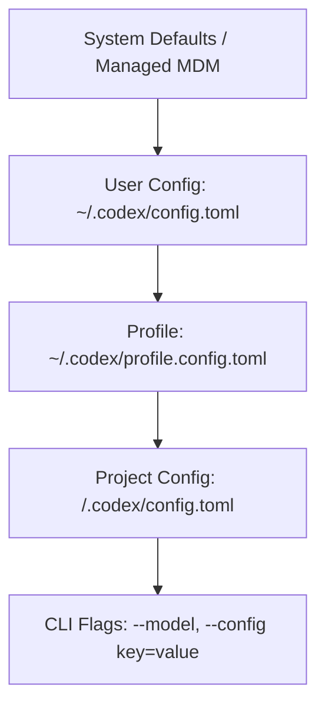

# Codex Configuration and Operations Guide

Codex is OpenAI's coding agent, designed for autonomous software development across terminal, desktop, and IDE environments. It combines model reasoning, tool execution, sandboxing, and subagent orchestration.

This guide explains how to configure Codex cleanly, layer instructions, connect tools, and enforce strict execution boundaries.

---

## 1. Prerequisites and Installation

Codex is available as a command-line interface (CLI) and as part of the ChatGPT desktop application.

### Installing the CLI
```bash
# Install via npm globally
npm install -g @openai/codex

# Verify installation
codex --version
```

### Authentication Options
Codex supports two authentication methods:

1. **ChatGPT sign-in:**
   Authenticate through the browser/account flow. Availability, models, and usage limits depend on the current ChatGPT plan and workspace policy:
   ```bash
   codex login
   ```
2. **OpenAI API Key:**
   Use a developer API key directly. This bypasses ChatGPT workspace sign-in and bills your OpenAI API platform account:
   ```bash
   export OPENAI_API_KEY="your-api-key-here"
   ```

Credential storage mode can be configured in `~/.codex/config.toml` via `cli_auth_credentials_store = "keyring"` (OS keychain) or `"file"`.

---

## 2. Configuration Hierarchy

Codex loads configuration using a multi-layered hierarchy. Settings closer to the current task override broader settings:



### A. User Configuration (`~/.codex/config.toml`)
Lives in `$CODEX_HOME/config.toml` (defaults to `~/.codex/config.toml`). This defines machine-wide defaults, custom model providers, global sandboxing rules, and telemetry.

### B. Named Profiles (`~/.codex/<profile>.config.toml`)
Profiles allow you to switch operational modes cleanly without modifying your base configuration:
```bash
codex --profile deep-review "Review this branch"
```

### C. Project-Scoped Configuration (`<repo>/.codex/config.toml`)
Project configuration allows repositories to declare project-specific hooks, rules, and root markers.

**Security note on project config:** Codex only loads `.codex/config.toml` if the repository is trusted. Furthermore, project configs cannot override machine-level settings such as `openai_base_url`, `model_provider`, `model_providers`, `notify`, `profile`, or `otel`.

---

## 3. Project Instructions (`AGENTS.md`)

Codex reads `AGENTS.md` before starting work. It discovers instructions in a specific order:

1. **Global Instructions:**
   Checks `~/.codex/AGENTS.override.md` first. If absent, loads `~/.codex/AGENTS.md`.
2. **Project Instructions:**
   Starting from the Git root down to the current working directory, Codex checks each folder for `AGENTS.override.md`, then `AGENTS.md`, then any names listed in `project_doc_fallback_filenames`.
3. **Merge Order:**
   Files are concatenated from root to current directory. Instructions closer to the working directory appear later in the prompt and take precedence.

### Best Practice: Keep AGENTS.md Small
Large permanent instructions waste context window space on every turn and dilute model attention.
- Keep root `AGENTS.md` concise. If your team uses a line-count target, treat it as a local heuristic rather than a Codex product limit.
- Restrict content to non-negotiable repository agreements (test commands, lint rules, loopback binding, commit conventions).
- Move task-specific workflows into on-demand **skills**.

---

## 4. Models and Providers in Codex

### OpenAI model selection
Codex works with current OpenAI coding-capable models. Choose based on capability, latency, and cost rather than assuming one fixed default:
- `gpt-6-sol`: Workhorse model for complex coding, refactoring, and multi-step tasks.
- `gpt-6-luna`: Fast, cost-efficient model for quick fixes, exploration, and high-volume operations.

You can specify reasoning effort per task:
```bash
codex --model gpt-6-sol --config model_reasoning_effort='"medium"'
```

### Custom Model Providers
To route Codex through an LLM proxy or private gateway, define a provider in `~/.codex/config.toml`:

```toml
model = "gpt-6-sol"
model_provider = "custom_proxy"

[model_providers.custom_proxy]
name = "Internal LLM Gateway"
base_url = "https://llm-gateway.example.com/v1"
env_key = "OPENAI_API_KEY"
wire_api = "responses" # or "chat_completions"
```

### Amazon Bedrock
Codex can route supported OpenAI models through Amazon Bedrock. Model IDs and regional availability are Bedrock-specific, so verify the current AWS/OpenAI compatibility guide before copying an example.

Do not copy a Bedrock model ID from another runtime. Verify the exact OpenAI model/provider path supported by your installed Codex version and the cloud deployment you actually use.

### Local OSS Mode
Run against local Ollama or LM Studio models:
```bash
codex --oss --local-provider ollama
```

---

## 5. Sandboxing and Approval Policies

Codex includes built-in sandboxing to protect host workstations.

### Sandbox Modes
- `read-only`: Filesystem modifications are completely blocked. Ideal for exploration, code auditing, and read-only subagents.
- `workspace-write` (Recommended): Can read filesystem; write operations are restricted strictly to the project root and configured `writable_roots`.
- `danger-full-access`: Sandboxing disabled. Use only inside isolated virtual machines or throwaway Docker containers.

### Approval Policies
Controls when Codex pauses for human approval before executing actions:
- `on-request`: Prompts before executing potentially impactful shell commands or filesystem writes outside the workspace.
- `never`: Autonomous execution. Used for headless CI runs or pre-sandboxed environments.
- `granular`: Fine-grained boolean switches per prompt category:
  ```toml
  approval_policy = { granular = { sandbox_approval = true, rules = true, mcp_elicitations = true, request_permissions = false, skill_approval = false } }
  ```

### Shell Environment Isolation
Prevent accidental leakage of host secrets (e.g., AWS, Azure, or SSH keys) to commands spawned by the agent:
```toml
[shell_environment_policy]
inherit = "core"
ignore_default_excludes = false

[shell_environment_policy.filters]
"AWS_*" = "exclude"
"AZURE_*" = "exclude"
"GITHUB_TOKEN" = "exclude"
```

---

## 6. Model Context Protocol (MCP) in Codex

MCP allows external tools and context servers to integrate with Codex.

### Stdio Server Configuration
```toml
[mcp_servers.context7]
command = "npx"
args = ["-y", "@upstash/context7-mcp"]
enabled = true
default_tools_approval_mode = "auto"
```

### HTTP / Remote Server Configuration
```toml
[mcp_servers.remote_docs]
url = "https://mcp.docs.example.com/sse"
auth = "oauth"
enabled = true
```

### Tool Curation
Limit tool exposure to prevent context bloat:
```toml
[mcp_servers.github]
command = "npx"
args = ["-y", "@modelcontextprotocol/server-github"]
enabled_tools = ["create_pull_request", "get_issue", "add_comment_to_issue"]
```

---

## 7. Subagents in Codex

Codex natively supports spawning specialized subagents for independent, parallel, or review tasks:

```toml
[agents]
enabled = true
# default_subagent_model = "YOUR_AVAILABLE_FAST_MODEL"
max_concurrent_threads_per_session = 3

[agents.reviewer]
description = "Independent senior code review focusing on correctness, edge cases, and architectural alignment."

[agents.explorer]
description = "Fast read-only exploration and evidence gathering across the codebase."

[agents.tester]
description = "Independent test execution, verification, and regression diagnosis."
```

Subagents inherit the parent's sandbox policy and return structured results to the primary agent upon completion.

---

## 8. Git and Worktree Integration

- **Native Review Pane:** Codex integrates with Git to track staged and unstaged diffs.
- **Git worktrees:** Codex surfaces can use isolated Git worktrees so separate runs do not have to dirty the primary checkout. Treat worktree creation and cleanup as execution-context management rather than relying on an undocumented command name.
- **Commit Hygiene:** Instructions should enforce concise, imperative commit messages and clean working trees before task completion.

---

## 9. Provider and gateway fallback strategy

A custom gateway should be a deliberate integration, not the first fix for a provider problem.

If a custom provider fails:

1. verify the upstream endpoint independently;
2. verify the exact Codex `model_provider`, `base_url`, `env_key`, and wire API expected by the installed version;
3. verify whether the setting belongs at user scope or project scope;
4. test one minimal Codex task;
5. only then add MCP, browser, or subagent complexity.

If the model/provider you want is not a supported Codex path, prefer a runtime that supports it directly rather than making the workstation depend on an always-on translation bridge.

### GitHub fallback

Use `gh auth status` as the baseline GitHub health check. If a GitHub MCP integration is broken but `gh` is healthy, use the GitHub CLI for normal repository operations while you diagnose the MCP layer separately.

### Browser fallback

Prefer a deterministic browser CLI/tooling path for routine verification. Add a browser MCP only when its structured tool surface provides real value. For existing authenticated browser sessions, use supported attach/extension mechanisms or a dedicated persistent automation profile rather than copying browser credential databases.

---

## 10. Troubleshooting Codex

| Symptom | Cause | Remedy |
|---|---|---|
| `Config load error: ignored key` | Setting machine-level keys in project `.codex/config.toml`. | Move `model_provider`, `openai_base_url`, or `otel` to `~/.codex/config.toml`. |
| `Access denied to path ...` | Sandbox blocked a write outside the workspace. | Add path to `sandbox_workspace_write.writable_roots` or keep writes inside workspace. |
| `Subagent timeout or limit reached` | Exceeded `max_concurrent_threads_per_session`. | Increase limit in `[agents]` or close completed subagents. |
| `Instructions truncated` | Total size of loaded `AGENTS.md` files exceeded limit. | Raise `project_doc_max_bytes` or trim verbose instructions. |
