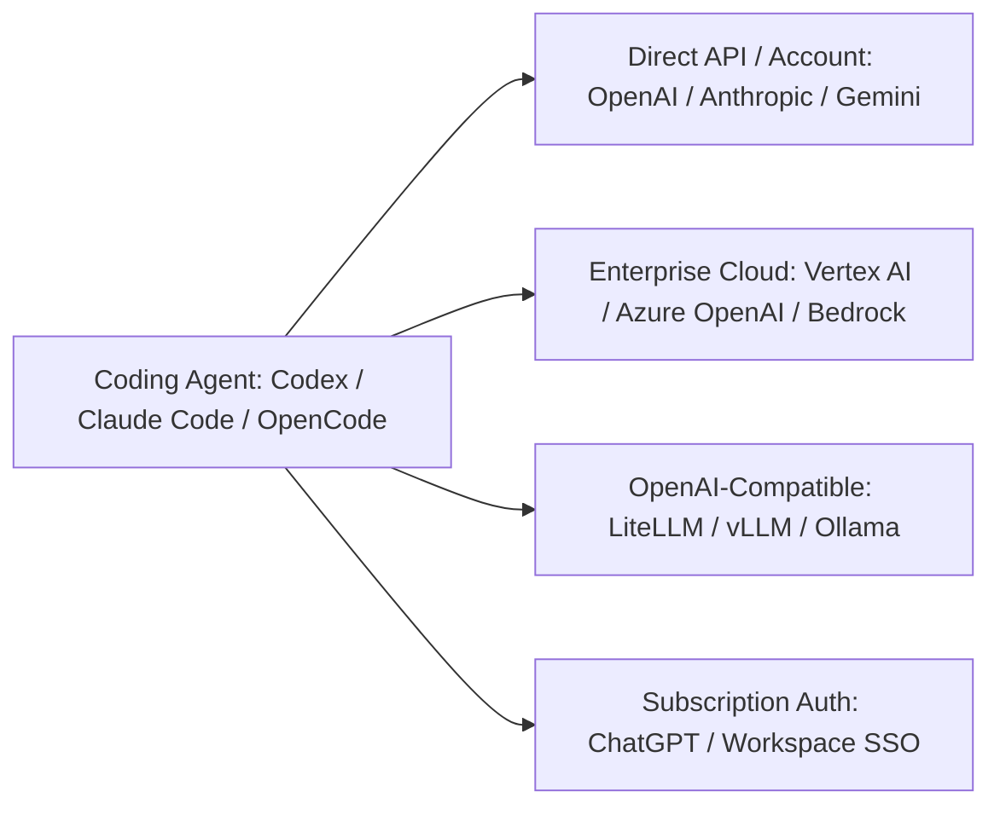

# Connecting and Testing LLM Providers

Before configuring coding agents, you must verify that your underlying model provider is reachable, authenticated, and functioning. An agent cannot self-correct if its network connection or API credentials fail silently.

This guide covers six common provider setups, explains architectural differences, and provides concrete smoke tests to verify connectivity.

---

## Provider Architecture Overview

Coding agents interact with language models through four primary integration patterns:

1. **Direct SaaS API (OpenAI, Anthropic, Google AI Studio):**
   Direct HTTP requests to the vendor's API gateway authenticated via an API key in a request header (`Authorization: Bearer <key>` or `x-api-key`). Best for developer experimentation and standard projects.
2. **Cloud-Hosted Enterprise Endpoints (Google Cloud Vertex AI, Azure OpenAI, Amazon Bedrock):**
   Models deployed inside an enterprise cloud tenant. Authentication relies on IAM tokens, managed identities, or OAuth2 service credentials (e.g., Google Application Default Credentials or Azure AD). Common when cloud IAM, regional controls, private networking, or enterprise compliance requirements matter.
3. **OpenAI-Compatible Gateways (LiteLLM, vLLM, Ollama, Groq, OpenRouter):**
   Intermediary proxies or self-hosted runtimes exposing an OpenAI-compatible API such as `/v1/chat/completions` and, where implemented, `/v1/responses`. Useful for routing, load balancing, fallback logic, or hosting open-weight models locally.
4. **Product-Native Subscription Authentication:**
   Account-level login sessions managed by the agent itself (such as ChatGPT Plus/Team/Enterprise subscription sign-in in Codex). Uses OAuth browser handshakes or token refresh loops rather than raw developer API keys.



---

## Claude Code uses a different provider model

Claude Code is built around Claude models rather than acting as a generic wrapper around OpenAI, Gemini, or arbitrary OpenAI-compatible model APIs. Anthropic documents direct Claude account / Anthropic Console access plus supported enterprise deployment paths through Amazon Bedrock, Google Cloud's Agent Platform, Microsoft Foundry, and other Anthropic deployment options.

That means the general preparation pattern in this repository transfers to Claude Code, while the model-provider configuration itself does not map one-to-one from Codex or OpenCode. See [`claude-code.md`](claude-code.md) and Anthropic's deployment overview: https://code.claude.com/docs/en/third-party-integrations

## Provider Matrix: Codex vs. OpenCode

Codex and OpenCode handle arbitrary provider configuration differently:

| Provider Type | Codex Configuration | OpenCode Configuration |
|---|---|---|
| **OpenAI** | Built-in default provider; set `OPENAI_API_KEY` or sign in via ChatGPT. | Native provider or `@ai-sdk/openai` in `opencode.json`. |
| **Anthropic Claude** | Do not assume direct support. Use only a provider/wire path documented for the installed Codex version; otherwise use a runtime that supports Claude natively. | Built-in/catalog provider support where available. |
| **Google Gemini API** | Do not assume an arbitrary Gemini endpoint can be dropped into Codex. Verify current Codex provider support first; a proxy is optional, not the default recommendation. | Native provider (`google`) with `GEMINI_API_KEY` where supported. |
| **Gemini on Vertex AI** | Verify current Codex support before adding a gateway. If unsupported, prefer a runtime with direct Vertex support over an always-on translation bridge. | V2 uses the `google-vertex` provider and Application Default Credentials (ADC), with project/location settings or supported environment variables. |
| **Azure OpenAI** | Configure a suitable custom model provider and the wire API required by the endpoint. | V2 can use the built-in Azure runtime package or a compatible custom provider. |
| **OpenAI-Compatible** | Defined in `[model_providers.<id>]` in Codex user configuration. | V2 defines custom providers under `providers.<id>` using an OpenCode runtime package such as `@opencode/ai/providers/openai-compatible`. |
| **Local OSS (Ollama/LM Studio)** | Use Codex local/OSS provider support where available. | V2 includes local runtime discovery for Ollama, LM Studio, and vLLM; endpoints can be overridden with provider settings. |

---

## 1. OpenAI Direct API

### Overview
Standard OpenAI developer access. Use a model ID currently available to your API project and the API surface required by the runtime. Do not copy a model name from another account or from this repository.

### Environment Variables
```bash
export OPENAI_API_KEY="your-api-key-here"
# Optional overrides:
export OPENAI_BASE_URL="https://api.openai.com/v1"
export OPENAI_MODEL="your-model-name"
```

### Raw Verification (curl)
```bash
curl https://api.openai.com/v1/responses \
  -H "Content-Type: application/json" \
  -H "Authorization: Bearer $OPENAI_API_KEY" \
  -d '{
    "model": "gpt-6-sol",
    "input": "ping",
    "max_output_tokens": 10
  }'
```

### Automated Smoke Test
```bash
python scripts/providers/test_openai.py
```

---

## 2. Google Gemini API (AI Studio / Developer API)

### Overview
Direct developer API for Gemini models hosted at `generativelanguage.googleapis.com`. Authenticated with an API key passed in the `x-goog-api-key` header.

### Environment Variables
```bash
export GEMINI_API_KEY="your-gemini-api-key-here"
export GEMINI_MODEL="your-model-name"
```

### Raw Verification (curl)
```bash
curl "https://generativelanguage.googleapis.com/v1beta/models/${GEMINI_MODEL}:generateContent" \
  -H "Content-Type: application/json" \
  -H "x-goog-api-key: $GEMINI_API_KEY" \
  -d '{
    "contents": [{"parts": [{"text": "ping"}]}],
    "generationConfig": {"maxOutputTokens": 10}
  }'
```

### Automated Smoke Test
```bash
python scripts/providers/test_gemini.py
```

---

## 3. Gemini through Google Cloud Vertex AI

### Overview
Enterprise-grade deployment of Gemini hosted within Google Cloud Platform. Does not use static API keys. Instead, it relies on Google Cloud Application Default Credentials (ADC) or service account OAuth2 access tokens.

### Prerequisites
1. An active GCP project with Vertex AI access.
2. Application Default Credentials (ADC) available to the runtime. `gcloud auth application-default login` is one developer-workstation path, but enterprise environments may provision ADC differently.
3. Know the exact project, location, and model ID you are entitled to use.

### Environment Variables
```bash
export GOOGLE_CLOUD_PROJECT="your-gcp-project-id"
export GOOGLE_CLOUD_LOCATION="us-central1"
export VERTEX_MODEL="your-model-name"
```

### Raw Verification (curl with gcloud token)
```bash
ACCESS_TOKEN=$(gcloud auth print-access-token)

curl "https://${GOOGLE_CLOUD_LOCATION}-aiplatform.googleapis.com/v1/projects/${GOOGLE_CLOUD_PROJECT}/locations/${GOOGLE_CLOUD_LOCATION}/publishers/google/models/${VERTEX_MODEL}:generateContent" \
  -H "Content-Type: application/json" \
  -H "Authorization: Bearer $ACCESS_TOKEN" \
  -d '{
    "contents": [{"role": "user", "parts": [{"text": "ping"}]}],
    "generationConfig": {"maxOutputTokens": 10}
  }'
```

### Automated Smoke Test
```bash
python scripts/providers/test_vertex.py
```

---

## 4. Anthropic Claude API

### Overview
Direct API for Anthropic models using the Messages API (`/v1/messages`). Requires `x-api-key` and the `anthropic-version` header.

### Environment Variables
```bash
export ANTHROPIC_API_KEY="your-anthropic-api-key-here"
export ANTHROPIC_MODEL="your-model-name"
```

### Raw Verification (curl)
```bash
curl https://api.anthropic.com/v1/messages \
  -H "Content-Type: application/json" \
  -H "x-api-key: $ANTHROPIC_API_KEY" \
  -H "anthropic-version: 2023-06-01" \
  -d '{
    "model": "your-model-name",
    "messages": [{"role": "user", "content": "ping"}],
    "max_tokens": 10
  }'
```

### Automated Smoke Test
```bash
python scripts/providers/test_anthropic.py
```

---

## 5. Microsoft Azure OpenAI

### Overview
Azure-hosted OpenAI instances. In Azure, calls route to a deployment name rather than a raw model string, and require an explicit `api-version` query parameter.

### Environment Variables
```bash
export AZURE_OPENAI_API_KEY="your-azure-api-key-here"
export AZURE_OPENAI_ENDPOINT="https://your-resource-name.openai.azure.com"
export AZURE_OPENAI_DEPLOYMENT="your-deployment-name"
export AZURE_OPENAI_API_VERSION="your-api-version"
```

### Raw Verification (curl)
```bash
curl "${AZURE_OPENAI_ENDPOINT}/openai/deployments/${AZURE_OPENAI_DEPLOYMENT}/chat/completions?api-version=${AZURE_OPENAI_API_VERSION}" \
  -H "Content-Type: application/json" \
  -H "api-key: $AZURE_OPENAI_API_KEY" \
  -d '{
    "messages": [{"role": "user", "content": "ping"}],
    "max_tokens": 10
  }'
```

### Automated Smoke Test
```bash
python scripts/providers/test_azure.py
```

---

## 6. Generic OpenAI-Compatible Gateway

### Overview
Covers self-hosted proxies and third-party gateways that implement an OpenAI-compatible API. Treat compatibility as something to verify: some runtimes require Responses API behavior, others accept Chat Completions, and tool-calling semantics can differ.

**Fallback rule:** use a compatibility gateway only when it solves a real provider gap. If the coding agent has a direct native provider path, prefer that first.

### Environment Variables
```bash
export COMPATIBLE_BASE_URL="https://your-proxy.example.com/v1"
export COMPATIBLE_API_KEY="your-proxy-key-if-required"
export COMPATIBLE_MODEL="your-model-name"
```

### Raw Verification (curl)
```bash
curl "${COMPATIBLE_BASE_URL}/chat/completions" \
  -H "Content-Type: application/json" \
  -H "Authorization: Bearer ${COMPATIBLE_API_KEY:-dummy}" \
  -d '{
    "model": "'"$COMPATIBLE_MODEL"'",
    "messages": [{"role": "user", "content": "ping"}],
    "max_tokens": 10
  }'
```

### Automated Smoke Test
```bash
python scripts/providers/test_compatible.py
```

---

## Credential Safety Checklist

- **Never commit `.env` files.** Always add `.env` and `.env.*` to `.gitignore`.
- **Do not embed keys in configuration files.** Prefer referencing environment variables (e.g. `env_key = "OPENAI_API_KEY"` in Codex, or `"{env:OPENAI_API_KEY}"` in OpenCode).
- **Use least-privilege API keys.** Restrict keys to required model endpoints and set monthly spend caps.
- **Sanitize error outputs.** Never let scripts or CI logs dump raw HTTP headers where `Authorization` or `api-key` values might leak.


---

## Provider troubleshooting order

When a coding agent cannot use a model, debug in this order:

1. verify the provider independently;
2. verify the exact model ID;
3. verify the runtime's native provider support;
4. verify the runtime's effective configuration;
5. run one minimal model task from the runtime;
6. only then add a proxy/gateway if it is genuinely required.

A raw provider test proves network/authentication. It does **not** prove Codex, Claude Code, or OpenCode is configured to use that provider.

If a compatibility bridge becomes the only reason the workstation works, document it as an explicit dependency and test it separately. Prefer removing the bridge when a direct provider path becomes available.
