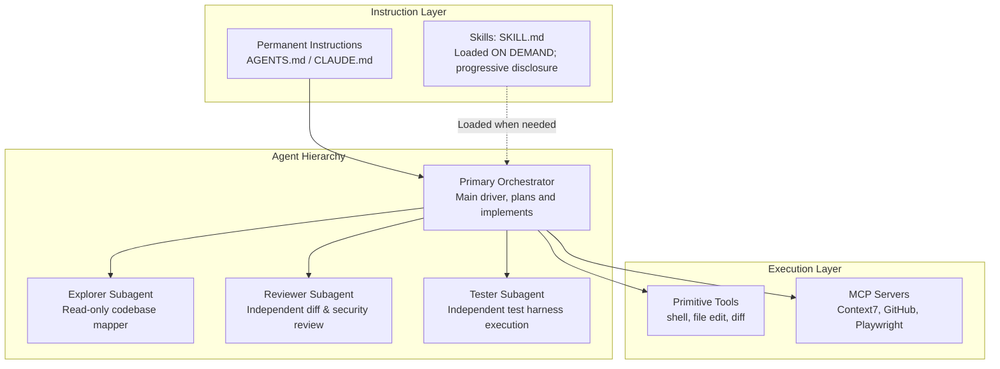

# Skills and Subagents Architecture

As coding agents become more autonomous, keeping instructions organized is critical. Dumping every rule, playbook, and test scenario into a single system prompt leads to prompt bloat, slow generation, and contradictory instructions.

To scale cleanly, separate capabilities into distinct architectural layers: **permanent instructions**, **skills**, **tools**, **MCP servers**, and **subagents**.

---

## Architectural Taxonomy

### Layer Definitions

1. **Permanent Instructions (`AGENTS.md` / `CLAUDE.md`):**
   - **Scope:** Baseline repository guidance loaded by the selected runtime.
   - **Purpose:** Non-negotiable repository invariants (e.g., "All tests must pass before committing", "Bind local dev servers to `127.0.0.1`", "Never hard-code secrets").
   - **Runtime mapping:** Codex and OpenCode commonly use `AGENTS.md`; Claude Code uses `CLAUDE.md` and can also read `AGENTS.md` on current versions.
   - **Guideline:** Keep it intentionally concise. Treat any line-count target as a team heuristic rather than a product limit; move specialized procedures into skills or task-specific documentation.

2. **Skills (On-Demand Workflows):**
   - **Scope:** Discovered via metadata; body loaded **only when the task matches the skill's triggers**.
   - **Purpose:** Specialized, procedural workflows (e.g., release engineering, database migrations, Figma-to-code translation, benchmark validation).
   - **Guideline:** Implements *progressive disclosure*. The root skill prompt is short; supporting scripts and references stay on disk until referenced.

3. **Primitive Tools:**
   - **Scope:** Atomic executable operations exposed directly to the model (`exec_command`, `apply_patch`).
   - **Purpose:** Atomic execution primitives providing filesystem mutation, process orchestration, and diff tracking.

4. **MCP Servers (Model Context Protocol):**
   - **Scope:** Standardized protocol connecting external context and service APIs to the agent.
   - **Purpose:** Bridges to third-party tools (GitHub, Context7, Playwright, databases).

5. **Primary Agent:**
   - **Scope:** The root conversational session.
   - **Purpose:** Evaluates user intent, coordinates execution, makes core code edits, and synthesizes final evidence.

6. **Subagents:**
   - **Scope:** Ephemeral child agents spawned with a bounded objective and explicit permissions.
   - **Purpose:** Independent, non-overlapping tasks such as exploration, adversarial review, or isolated test verification.

---

## Runtime mapping

The same architecture appears under different file names:

| Capability | Codex | Claude Code | OpenCode |
|---|---|---|---|
| Permanent project instructions | `AGENTS.md` | `CLAUDE.md` and/or `AGENTS.md` | `AGENTS.md` |
| Project skills | Skills | `.claude/skills/<name>/SKILL.md` | Runtime skills/tooling |
| Project subagents | `[agents]` configuration | `.claude/agents/*.md` | `agents` configuration |
| External tools | MCP servers | MCP servers / `.mcp.json` | `mcp.servers` |
| Deterministic lifecycle automation | Hooks | Hooks in settings / skills / agents | Runtime/plugin dependent |

Do not force one runtime's syntax onto another. Share the engineering principles, then use each product's native configuration model.

---

## Subagent Blueprints

Subagents should be specialized by role rather than generic clones of the primary agent. Here are four practical subagent blueprints:

### 1. Explorer Subagent
- **Objective:** Map unknown codebases, discover file dependencies, and collect citations.
- **Model Profile:** Fast model (a fast model or the runtime's lightweight model tier), low reasoning effort.
- **Permissions:** Read-only in the runtime's permission model; allow only the minimum inspection commands needed.
- **When to use:** Starting work in a large unfamiliar repository or locating all downstream callers before refactoring an interface.

### 2. Reviewer Subagent
- **Objective:** Inspect completed diffs for correctness, regressions, edge cases, and code style.
- **Model Profile:** High-intelligence model (a high-capability model appropriate for review), high reasoning effort.
- **Permissions:** Read-only (`edit: deny`, `bash: deny`).
- **Prompt Invariant:** *"You are an independent senior code reviewer. Your role is adversarial: find subtle bugs, missing error handling, and unverified assumptions. Do not approve work without inspecting the actual git diff."*

### 3. Tester Subagent
- **Objective:** Run test suites, reproduce bug reports with minimal failing cases, and verify fixes.
- **Model Profile:** Balanced model (`gpt-6-sol`), medium reasoning effort.
- **Permissions:** Allow test execution and only the file edits genuinely needed for test fixtures or reproductions.
- **When to use:** Verifying that a bug is genuinely reproducible before editing implementation code.

### 4. Security Subagent
- **Objective:** Scan the repository and recent diffs for secrets, injection vectors, unsafe deserialization, and privilege escalation.
- **Model Profile:** High-intelligence model, high reasoning effort.
- **Permissions:** Read-only in the runtime's permission model; allow only the inspection commands needed for the audit.
- **When to use:** Pre-commit audit before opening pull requests or pushing public repositories.

---

## Delegation Anti-Patterns

Delegating to subagents introduces coordination latency. Avoid these four common traps:

1. **The Trivial Delegation Trap:**
   Spawning a subagent to run a single `git status` or read a 10-line file. If an operation takes one tool call and does not benefit from an isolated context, execute it locally in the primary agent.

2. **Overlapping Write Sets:**
   Spawning two subagents with write access to the same directory at the same time. This inevitably creates merge conflicts, race conditions, and overwritten files.
   *Rule:* Subagents should either be read-only, or each assigned an exclusive, disjoint set of files.

3. **Critical-Path Blocking:**
   Spawning a subagent for a task that blocks your very next step, then immediately waiting on it. If your next action is blocked, perform the task directly in the main thread to keep momentum.

4. **Unbounded Spawning:**
   Allowing subagents to recursively spawn further subagents. Cap concurrency strictly (e.g. `max_concurrent_threads_per_session = 3` in Codex).

---

## Summary Checklist: Where Does an Instruction Belong?

| Question | Destination |
|---|---|
| Does this rule apply to every single task in the repository? | `AGENTS.md` or `CLAUDE.md`, depending on runtime |
| Is this a specialized procedure only needed for specific tasks (e.g., deploying, creating a migration)? | Skill (`SKILL.md`) |
| Does this require querying a live external service or database? | MCP Server |
| Does this require an adversarial, fresh perspective without conversation bias? | Reviewer Subagent |
| Does this require fast, wide search across dozens of files? | Explorer Subagent |
