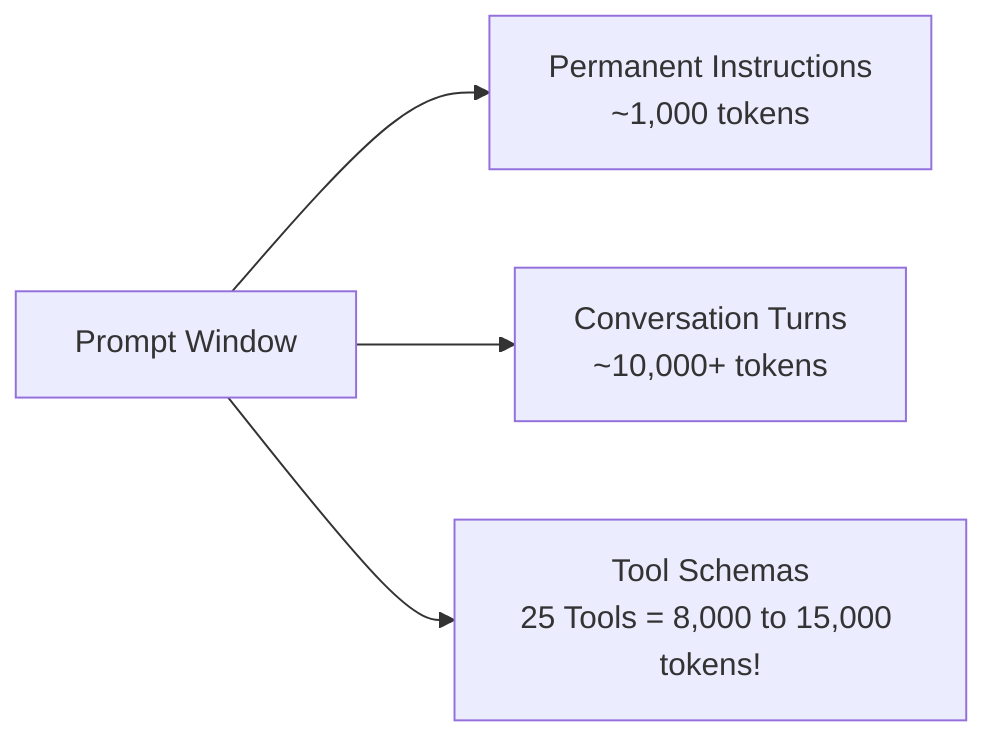

# Curating Tools and Preventing Agent Overload

One of the most common mistakes in configuring AI coding agents is enabling every available tool and MCP server simultaneously.

More tools do not produce a smarter agent. They consume context tokens, confuse model tool selection, increase latency, and degrade instruction following.

---

## The Cost of Tool Overload

Every tool registered with an agent injects its JSON Schema into the model's system prompt on **every single turn**.

### Why Overloading Fails in Practice:
1. **Context Window Tax:** 20 tools can easily consume 8,000 to 15,000 tokens before the user prompt is even read.
2. **Tool Selection Ambiguity:** When an agent has 3 different ways to search for files (built-in shell `find`, MCP filesystem tool, and a custom search tool), the model often hesitates, hallucinates arguments, or picks suboptimal tools.
3. **Increased Latency:** Larger prompt payloads directly increase time-to-first-token (TTFT) on every turn.
4. **Brittle Execution:** More external tool processes create more points of failure (broken pipes, port conflicts, process crashes).

---

## Tool Categories and When to Use Them

### 1. Core Shell and Native Tooling
- **What it solves:** Direct execution of compilers, linters, test runners, and file manipulation.
- **Verdict:** **Mandatory.** A coding agent without a shell cannot verify its work.
- **Best practices:** Prefer standard utilities (`rg` for code search, `fd` for file discovery, `git` for diff tracking).

### 2. Live Documentation (Context7 / Developer Docs MCP)
- **What it solves:** Access to current framework APIs, recent breaking changes, and SDK updates that post-date the model's knowledge cutoff.
- **Verdict:** **High value.** Prevents hallucinated method signatures in rapidly changing ecosystems (React, Next.js, LangChain, SDKs).
- **Rule:** Add only when working with modern third-party libraries; disable for pure language standard-library tasks.

### 3. GitHub MCP / GitHub CLI
- **What it solves:** Pull request creation, issue tracking, and inline review comment resolution.
- **Verdict:** **Selective.** Keep disabled during local feature development. Enable when agent workflows involve multi-branch PR management or automated CI review triage.

### 4. Browser Automation (Playwright vs. Computer Use)
- **Deterministic Browser (Playwright):**
  - Directly queries the DOM, fills forms, clicks buttons, evaluates JavaScript, and captures screenshots.
  - **Verdict:** Highly reliable for automated web testing and verifying that a loopback frontend server works.
- **Visual Computer Use (OS / Desktop UI):**
  - Operates via mouse coordinates and visual screen capture.
  - **Verdict:** Brittle and resource-intensive. Reserve strictly for legacy desktop apps that lack CLI or API interfaces. Never use for web applications when Playwright is available.

---

## The Three Standard Profiles

Rather than enabling everything globally, organize your agent configurations into three distinct profiles:

### Profile 1: MINIMAL
*For standard CLI development, bug fixes, algorithmic work, and backend scripts.*

- **Tools:** Shell, Git, built-in file editor.
- **MCP Servers:** None.
- **Subagents:** None.
- **Context Footprint:** Very low (< 1,500 tokens).
- **Speed:** Maximum.

### Profile 2: ENGINEERING (Recommended Default)
*For full-stack features, third-party library integrations, and repository maintenance.*

- **Tools:** Shell, Git, built-in file editor.
- **MCP Servers:** Context7 (live library docs), GitHub MCP (PR/issue sync).
- **Subagents:** `reviewer` (read-only code review), `tester` (test execution).
- **Context Footprint:** Moderate (~4,000–6,000 tokens).
- **Reliability:** High; provides fresh documentation and independent verification.

### Profile 3: BROWSER
*For frontend development, web application QA, and end-to-end user flow verification.*

- **Tools:** Engineering Profile + Playwright MCP server.
- **Subagents:** `reviewer`, `tester`.
- **Context Footprint:** High (~8,000–12,000 tokens).
- **Rule:** Enforce loopback-only binding (`http://127.0.0.1:<port>`). Close browser sessions immediately when verification finishes.

---

## Tool Comparison Matrix

| Tool / MCP Server | What it solves | When to add it | When not to add it | Auth Required? | Context Cost |
|---|---|---|---|---|---|
| **Shell (`exec_command`)** | Running tests, builds, git, and local scripts. | Always (baseline agent engine). | Read-only analysis tasks. | No (inherits process) | Low (500 tokens) |
| **File Editor (`apply_patch`)** | Precise multi-file updates and unified diffs. | Always. | Read-only audit tasks. | No | Low (400 tokens) |
| **Context7 MCP** | Up-to-date documentation and code examples. | Using external libraries/frameworks. | Pure standard library or internal-only code. | No (public tier) or API key | Medium (~1,200 tokens) |
| **GitHub MCP** | PRs, issue updates, review threads, and diff checks. | CI/CD pipelines, PR reviews, automated release notes. | Offline or local-only feature implementation. | Yes (`GITHUB_TOKEN`) | High (~2,500–4,000 tokens) |
| **Playwright MCP** | Programmatic browser testing, DOM checks, screenshots. | Web app frontend verification on loopback servers. | Backend APIs, CLI tools, libraries. | No | High (~3,000–5,000 tokens) |
| **Computer Use** | Native desktop UI control via mouse/keystroke coordinates. | Legacy desktop applications with zero APIs or CLIs. | Any web or CLI workflow. | No | Very High (~6,000+ tokens) |
| **Database MCP** | Querying staging or dev database schemas directly. | Complex SQL migration authoring and schema inspection. | General coding; risks accidental production writes. | Yes (DB credentials) | Medium (~1,500 tokens) |
| **Slack / Email MCP** | Sending messages and team notifications. | Dedicated communication automations. | Core coding tasks (distracts agent and leaks tokens). | Yes (OAuth/Token) | High (~3,000 tokens) |

---

## Practical Rule of Thumb

> **If a capability can be executed via a standard CLI command (`gh pr create`, `curl`, `pytest`, `npm test`), prefer the shell tool over adding a dedicated MCP server.**

Reserve MCP servers for capabilities that require structured JSON-RPC interaction, streaming context, or rich external documentation search that cannot be matched by a simple CLI call.
