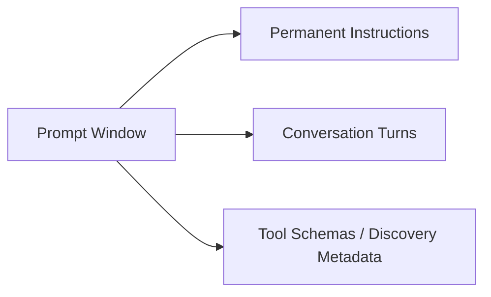

# Curating Tools and Preventing Agent Overload

One of the most common mistakes in configuring AI coding agents is enabling every available tool and MCP server simultaneously.

More tools do not produce a smarter agent. They consume context tokens, confuse model tool selection, increase latency, and degrade instruction following.

---

## The Cost of Tool Overload

Registered tools can add schema, discovery, and tool-selection overhead. The exact context cost depends on the runtime and whether it supports selective or deferred tool loading.

### Why Overloading Fails in Practice:
1. **Context and discovery overhead:** Large tool catalogs can consume prompt space or require extra discovery steps, depending on the runtime.
2. **Tool Selection Ambiguity:** When an agent has 3 different ways to search for files (built-in shell `find`, MCP filesystem tool, and a custom search tool), the model often hesitates, hallucinates arguments, or picks suboptimal tools.
3. **Increased Latency:** Larger prompt payloads directly increase time-to-first-token (TTFT) on every turn.
4. **Brittle Execution:** More external tool processes create more points of failure (broken pipes, port conflicts, process crashes).

---

## Tool Categories and When to Use Them

### 1. Core Shell and Native Tooling
- **What it solves:** Direct execution of compilers, linters, test runners, and file manipulation.
- **Verdict:** **Mandatory.** A coding agent without a shell cannot verify its work.
- **Best practices:** Prefer standard utilities (`rg` for code search, `fd` for file discovery, `git` for diff tracking).

### 2. Live Documentation (Context7 / Developer Docs MCP)
- **What it solves:** Access to current framework APIs, recent breaking changes, and SDK updates that post-date the model's knowledge cutoff.
- **Verdict:** **High value.** Prevents hallucinated method signatures in rapidly changing ecosystems (React, Next.js, LangChain, SDKs).
- **Rule:** Add only when working with modern third-party libraries; disable for pure language standard-library tasks.

### 3. GitHub MCP / GitHub CLI
- **What it solves:** Pull request creation, issue tracking, and inline review comment resolution.
- **Verdict:** **Selective.** Keep disabled during local feature development. Enable when agent workflows involve multi-branch PR management or automated CI review triage.

### 4. Browser Automation (CLI first, MCP when useful)
- **Playwright CLI:**
  - Directly drives Chromium-family browsers, fills forms, clicks, snapshots, and captures screenshots.
  - **Verdict:** Preferred default for coding agents because it keeps the browser capability available without loading a large MCP tool catalog.
- **Chrome DevTools MCP:**
  - Best for console, network, runtime, and performance inspection.
  - **Verdict:** Excellent complement to Playwright CLI; keep it slim when the server supports selective tooling.
- **Playwright MCP:**
  - Rich structured browser tool surface.
  - **Verdict:** Useful when MCP-native browser tools materially improve the workflow; otherwise keep it disabled.
- **Visual Computer Use (OS / Desktop UI):**
  - Operates via visual interaction when deterministic browser tooling is unavailable.
  - **Verdict:** Reserve for workflows that cannot be handled through browser-native or API/CLI paths.

---

## The Three Standard Profiles

Rather than enabling everything globally, organize your agent configurations into three distinct profiles:

### Profile 1: MINIMAL
*For standard CLI development, bug fixes, algorithmic work, and backend scripts.*

- **Tools:** Shell, Git, built-in file editor.
- **MCP Servers:** None.
- **Subagents:** None.
- **Context Footprint:** Low.
- **Speed:** Maximum.

### Profile 2: ENGINEERING (Recommended Default)
*For full-stack features, third-party library integrations, and repository maintenance.*

- **Tools:** Shell, Git, built-in file editor.
- **MCP Servers:** Context7 (live library docs), GitHub MCP (PR/issue sync).
- **Subagents:** `reviewer` (read-only code review), `tester` (test execution).
- **Context Footprint:** Medium.
- **Reliability:** High; provides fresh documentation and independent verification.

### Profile 3: BROWSER
*For frontend development, web application QA, and end-to-end user flow verification.*

- **Tools:** Engineering Profile + Playwright CLI.
- **Optional MCP:** Chrome DevTools MCP for deep diagnostics; Playwright MCP only when needed.
- **Subagents:** `reviewer`, `tester`.
- **Context Footprint:** Medium by default; high only when richer browser MCPs are enabled.
- **Rule:** Enforce loopback-only binding (`http://127.0.0.1:<port>`). If you attach to a browser the user already had open, detach when finished instead of closing it.

---

## Tool Comparison Matrix

| Tool / MCP Server | What it solves | When to add it | When not to add it | Auth Required? | Context Cost |
|---|---|---|---|---|---|
| **Shell (`exec_command`)** | Running tests, builds, git, and local scripts. | Always (baseline agent engine). | Read-only analysis tasks. | No (inherits process) | Low |
| **File Editor (`apply_patch`)** | Precise multi-file updates and unified diffs. | Always. | Read-only audit tasks. | No | Low |
| **Context7 MCP** | Up-to-date documentation and code examples. | Using external libraries/frameworks. | Pure standard library or internal-only code. | No (public tier) or API key | Medium |
| **GitHub MCP** | PRs, issue updates, review threads, and diff checks. | CI/CD pipelines, PR reviews, automated release notes. | Offline or local-only feature implementation. | Yes (`GITHUB_TOKEN`) | Medium to High |
| **Playwright CLI** | Deterministic browser interaction with low agent-tool overhead. | Normal web UI verification and flows. | Non-browser tasks. | No | Low to Medium |
| **Chrome DevTools MCP** | Console, network, runtime, performance diagnostics. | Deep browser debugging after reproducing the issue. | Simple click/fill flows. | No | Medium |
| **Playwright MCP** | Rich MCP-native browser automation. | When the MCP tool surface materially helps the workflow. | Routine browser tasks already covered by Playwright CLI. | No | High |
| **Computer Use** | Native desktop UI control via mouse/keystroke coordinates. | Desktop workflows with no suitable API/CLI or browser automation path. | Prefer deterministic tools when available. | Depends on environment | Very High |
| **Database MCP** | Querying staging or dev database schemas directly. | Complex SQL migration authoring and schema inspection. | General coding; risks accidental production writes. | Yes (DB credentials) | Medium |
| **Slack / Email MCP** | Sending messages and team notifications. | Dedicated communication automations. | Core coding tasks (distracts agent and leaks tokens). | Yes (OAuth/Token) | High |

---

## Practical Rule of Thumb

> **If a capability can be executed via a standard CLI command (`gh pr create`, `curl`, `pytest`, `npm test`), prefer the shell tool over adding a dedicated MCP server.**

Reserve MCP servers for capabilities that require structured JSON-RPC interaction, streaming context, or rich external documentation search that cannot be matched by a simple CLI call.

---

## Browser session reuse

When a task explicitly targets an already-open authenticated browser, do not default to a clean profile.

Preferred order:

1. use the browser automation tool's supported attach/extension mechanism;
2. operate the existing tab/session;
3. detach when done;
4. if attach is unavailable, use a dedicated persistent automation profile.

Do not copy browser `Cookies`, `Login Data`, `Web Data`, or `Local State` databases as a session-migration shortcut. Those files contain live authentication material and are the wrong abstraction for normal browser automation.
