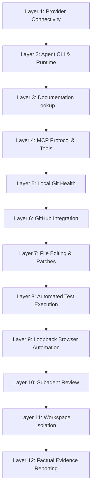

# The 12-Layer Validation Ladder

When configuring an autonomous coding agent, issues often compound. If an agent fails to write code correctly, the root cause could be an expired provider token, a broken MCP handshake, a restrictive sandbox setting, or bad prompt wording.

To diagnose and build reliable setups, always validate your agent environment using the **12-Layer Validation Ladder**.

---

## The 12 Layers



---

## Layer-by-Layer Verification Guide

### Layer 1: Provider Connectivity
- **Question:** Can your machine reach the model endpoint and authenticate?
- **Verification:** Run a raw curl or the dedicated smoke test script:
  ```bash
  python scripts/providers/test_openai.py
  ```
- **Pass Criteria:** HTTP 200 with non-empty text response. No credentials leaked in stdout.

### Layer 2: Agent CLI & Runtime
- **Question:** Is the agent binary installed and functioning?
- **Verification:**
  ```bash
  codex --version
  claude --version
  opencode --version
  ```
- **Pass Criteria:** The runtime(s) you intend to use return clean version output without crashes or missing dynamic libraries.

### Layer 3: Documentation Lookup
- **Question:** Can the agent fetch up-to-date third-party documentation?
- **Verification:** Ask the agent to look up a recent API method from Context7 or OpenAI docs.
- **Pass Criteria:** Accurate method signatures retrieved without guessing or hallucinating deprecated APIs.

### Layer 4: MCP Protocol & Tools
- **Question:** Do configured MCP servers start cleanly and register their tools?
- **Verification:** Use the runtime's native MCP status command. For OpenCode, also distinguish service health from MCP reconciliation:
  ```bash
  opencode api GET /api/info
  opencode reload
  opencode mcp list
  ```
- **Pass Criteria:** Required MCP servers connect after the runtime's normal initialization/reload window. Optional MCPs may remain disabled by design.
- **Fallback check:** If a GitHub MCP fails but `gh auth status` succeeds, record GitHub CLI as the operational fallback rather than treating the whole environment as broken.

### Layer 5: Local Git Health
- **Question:** Is the workspace inside an initialized Git repository with clean tracking?
- **Verification:**
  ```bash
  git status
  ```
- **Pass Criteria:** Clean working tree or known uncommitted files properly staged/unstaged. `.gitignore` is active.

### Layer 6: GitHub Integration
- **Question:** Can the agent create pull requests and read remote issues if needed?
- **Verification:**
  ```bash
  gh auth status
  ```
- **Pass Criteria:** Authenticated account has appropriate permissions for the target repository.

### Layer 7: File Editing & Patches
- **Question:** Can the agent read files and apply atomic patches without file corruptions?
- **Verification:** Test small multi-line edits and ensure indentation and line endings (LF/CRLF) are preserved.
- **Pass Criteria:** Patches apply cleanly; no unintended lines modified.

### Layer 8: Automated Test Execution
- **Question:** Can the agent run unit and integration tests and correctly parse failures?
- **Verification:**
  ```bash
  python -m unittest discover tests
  ```
- **Pass Criteria:** Test runner exits with zero exit code on success, and the agent accurately diagnoses failures.

### Layer 9: Loopback Browser Automation
- **Question:** If building web applications, can the agent verify the UI in a real browser?
- **Verification:** Launch the dev server on `127.0.0.1:<port>`, then use Playwright CLI for the user flow. Escalate to Chrome DevTools MCP for console/network/runtime inspection when needed.
- **Authenticated-session case:** If the task targets an already-open browser, use a supported attach/extension mechanism. If attach is unavailable, use a dedicated persistent automation profile.
- **Pass Criteria:** Page loads, expected elements can be interacted with, errors are diagnosed from observable browser evidence, and the agent detaches/closes only the sessions it created.

### Layer 10: Subagent Review
- **Question:** Can the primary agent delegate an independent code review to a subagent?
- **Verification:** Trigger a review pass on a branch diff using a reviewer subagent.
- **Pass Criteria:** Subagent provides actionable feedback without modifying files or reverting the primary agent's work.

### Layer 11: Workspace and Repository Hygiene
- **Question:** Is the repository content clean, and do the observed task logs/evidence support workspace-scoped behavior?
- **Verification:**
  ```bash
  python scripts/validation/safety_check.py
  ```
- **Pass Criteria:** The repository-content scan reports no configured findings, and separate execution evidence shows no unexpected writes or global configuration mutations. The scanner alone cannot prove host-wide isolation.

### Layer 12: Factual Evidence Reporting
- **Question:** Does the agent report actual observable evidence rather than hollow assertions?
- **Pass Criteria:** The completion message quotes real test output, PIDs, URLs, and git diff summaries.

---

## Debugging Hierarchy Principle

> **Always troubleshoot from bottom to top. Never debug a higher layer when a lower layer is broken.**

- **Do not troubleshoot browser tooling** if your local dev server fails to start on `127.0.0.1`.
- **Do not rewrite `AGENTS.md`** if the provider API key is returning HTTP 401 Unauthorized.
- **Do not debug subagent coordination** if primitive shell commands are failing in the sandbox.
- **Do not modify application code** if the test harness itself is misconfigured.


## What the automated checks do not prove

The repository scripts validate only what they can observe from the target workspace and the commands they execute. They do **not** prove that an agent never touched files outside the workspace, never changed machine-level settings, or never performed an external action. Use sandboxing, Git history, process/network evidence, and platform audit controls when those guarantees matter.


## Recovery evidence to capture

For a prepared workstation, keep a short record of the fallback that actually worked. Examples:

- CLI and Desktop version alignment;
- effective provider/model from the runtime, not only raw API connectivity;
- MCP state before and after reload;
- `gh auth status` when GitHub MCP is optional or unhealthy;
- browser attach vs persistent-profile path;
- service bind address/port when a Desktop depends on a local background server.

This evidence turns a one-off successful setup into a reproducible runbook.
